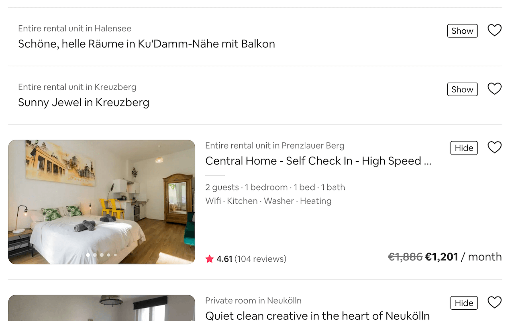

# Airbnb Sanity 🧳

**Chrome extension to hide Airbnb listings you don't like.**

Tired of looking through the same Airbnb listing for the fifth time, trying to remember if you liked it or not? Just hide it from all search results! This extension adds a small button to each listing in Airbnb's search results, which lets you hide it. Preserved across reruns, navigating between pages, changing the map, etc.

---

<h3 align="center">
  📥 <a href="https://chrome.google.com/webstore/detail/airbnb-sanity/llhacdfeohoajoacfiiolfhopfbnmhgc">Add to Chrome</a> 📥
</h3>

---

    

## Usage

Install from the [Chrome web store](https://chrome.google.com/webstore/detail/airbnb-sanity/llhacdfeohoajoacfiiolfhopfbnmhgc). Search for listings on Airbnb. The extension will automatically add a button to each listing to hide it.

## Development

Clone this repo, go to `chrome://extensions/`, enable developer mode, click on **Load unpacked**, and select this directory.
